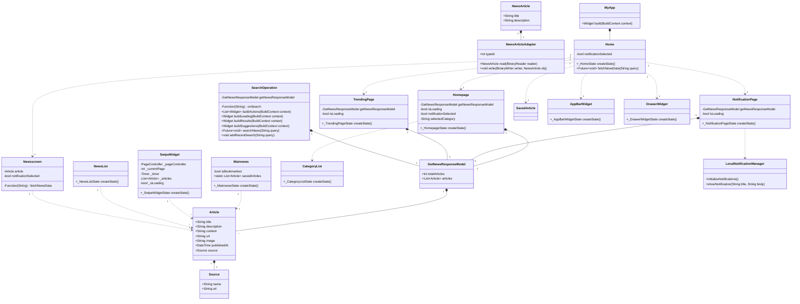

# newsapp

A new Flutter project.

A Flutter project for a news application called "NewsNOW". The project consists of several files, each containing different widgets, screens, models, and utility classes. Here's a breakdown of the code:

1. `lib/common_widgets/appBar.dart`:

   - Defines a custom `AppBar` widget with a title, search icon, and notification icon.
   - The search icon opens a search delegate when clicked, allowing users to search for news articles.
   - The notification icon navigates to the `NotificationPage` when clicked.

2. `lib/common_widgets/Build_Text_Widget.dart`:

   - Defines a reusable `BuildTextWidget` that displays text with customizable color, font size, and styling.

3. `lib/common_widgets/category_widget.dart`:

   - Defines a `Categorylist` widget that displays a horizontal list of news categories.
   - When a category is selected, the `onCategorySelected` callback function is called with the selected category.

4. `lib/common_widgets/drawer_widget.dart`:

   - Defines a `Drawer` widget with navigation options for the Home, Saved Articles, Trending, and Settings screens.

5. `lib/common_widgets/newspg.dart`:

   - Defines a `Mainnews` widget that displays the details of a news article, including the title, description, content, and image.
   - Provides options to share the article and bookmark/unbookmark it.
   - Maintains a list of saved articles across the app.

6. `lib/common_widgets/News_Display_List.dart`:

   - Defines a `NewsList` widget that displays a list of news articles in a `ListView.builder`.
   - Each article is displayed as a `ListTile` with a title and thumbnail image (if available).
   - Tapping on an article navigates to the `Newsscreen` page, passing the selected article.

7. `lib/common_widgets/SearchDeligate.dart`:

   - Defines a `SearchOperation` class that extends `SearchDelegate` and handles search functionality.
   - Allows users to search for news articles and displays the search results in a `NewsList` widget.
   - Maintains a list of recent searches and provides suggestions based on the user's input.

8. `lib/common_widgets/swipe_widget.dart`:

   - Defines a `SwipeWidget` that displays a carousel of news article images.
   - The images automatically scroll at a fixed interval.
   - Tapping on an image navigates to the `Newsscreen` page, passing the selected article.

9. `lib/main.dart`:

   - The entry point of the application.
   - Initializes Hive (a lightweight, cross-platform key-value database) and registers the `NewsArticle` adapter.
   - Defines the `MyApp` and `Home` widgets, which serve as the root and home screen of the application, respectively.
   - The `Home` widget sets up the app bar with the `appBar` widget and provides a `fetchNewsData` function to fetch and store news data in Hive.

10. `lib/models/Get_News_Response_Models.dart`:

    - Defines the data models for the news response received from the GNews API.
    - Contains classes like `GetNewsResponseModel`, `Article`, and `Source`.

11. `lib/models/news_article.dart`:

    - Defines the `NewsArticle` model class, which is used to store news articles in Hive.

12. `lib/notification/localnotification.dart`:

    - Provides functionality to initialize and show local notifications on the device.
    - Uses the `flutter_local_notifications` plugin to display notifications with the title and description of the latest news article.

13. `lib/screens/homepage.dart`:

    - Defines the `Homepage` widget, which serves as the main screen of the application.
    - Displays a swipe widget with a carousel of news article images.
    - Renders a list of news articles based on the selected category, using the `NewsList` widget.
    - Provides a `Categorylist` widget to allow users to filter news by category.

14. `lib/screens/newsscreen.dart`:

    - Defines the `Newsscreen` widget, which displays the details of a selected news article using the `Mainnews` widget.

15. `lib/screens/notification_page.dart`:

    - Defines the `NotificationPage` widget, which displays a list of the latest news articles.
    - Fetches news data periodically (every 30 minutes) and shows a local notification with the title and description of the latest article.

16. `lib/screens/saved_article.dart`:

    - Defines the `SavedArticle` widget, which displays a list of saved news articles using the `NewsList` widget.

17. `lib/screens/trending.dart`:
    - Defines the `TrendingPage` widget, which displays a list of trending news articles using the `NewsList` widget.

The project uses the GNews API (`https://gnews.io/api/v4/search`) to fetch news data and displays it in various forms throughout the application. It also incorporates features like search, categories, bookmarking articles, sharing articles, local notifications, and persistent storage using Hive.

```tree
lib/
├── common_widgets/
│   ├── appBar.dart
│   ├── Build_Text_Widget.dart
│   ├── category_widget.dart
│   ├── drawer_widget.dart
│   ├── newspg.dart
│   ├── News_Display_List.dart
│   ├── SearchDeligate.dart
│   └── swipe_widget.dart
├── models/
│   ├── Get_News_Response_Models.dart
│   ├── news_article.dart
│   └── news_article.g.dart
├── notification/
│   └── localnotification.dart
├── screens/
│   ├── homepage.dart
│   ├── newsscreen.dart
│   ├── notification_page.dart
│   ├── saved_article.dart
│   └── trending.dart
└── main.dart
```


